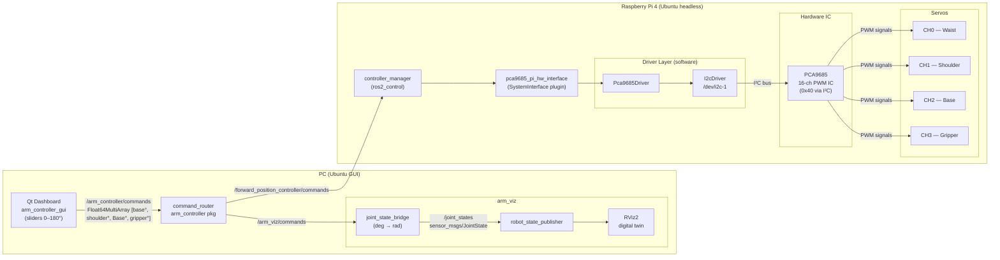

# 4-DOF Robotic Arm — ROS 2 Control Stack

A complete ROS 2 (Jazzy) control stack for a 4-degree-of-freedom servo arm driven by a **PCA9685 PWM controller** on a Raspberry Pi, with a **Qt dashboard** and **RViz2 digital twin** running on a desktop PC.

## Architecture Overview

The system is split across two machines connected over the same ROS 2 network (same `ROS_DOMAIN_ID`):

| Machine | Role |
|---|---|
| **Desktop PC** | Qt dashboard (user input), `arm_controller` (command router), `arm_viz` + RViz2 (digital twin) |
| **Raspberry Pi 4** | `pca9685_pi_hw_interface` (ros2_control hardware plugin), PCA9685 over I²C, physical servos |

The user moves sliders in the Qt dashboard → a `Float64MultiArray` of four joint angles is published on `/arm_controller/commands` → the `command_router` node fans it out simultaneously to the **hardware controller** (real servos) and to the **digital twin bridge** (RViz2 visualisation), so both update in lock-step.


## System Diagram




## Package Descriptions

### `pca9685_pi_hw_interface` — Hardware Interface Plugin
> Runs on the **Raspberry Pi**.

Implements the `hardware_interface::SystemInterface` lifecycle plugin for ros2_control. Owns the full driver stack:

- **`I2cDriver`** — thin RAII wrapper around `/dev/i2c-N` using Linux `ioctl`. Opens the bus, sets 7-bit slave addressing, and provides `read_byte` / `write_byte` primitives.
- **`Pca9685Driver`** — register-level driver for the NXP PCA9685 16-channel PWM IC. Handles oscillator setup, prescaler calculation (with empirical 0.8449× frequency correction for real-world oscillator drift), per-channel pulse-width writes, sleep/wake, and a convenience brightness API.
- **`Pca9685PiHwInterface`** — ros2_control plugin. Reads joint parameters (`channel`, `min_pulse_us`, `max_pulse_us`, `min_angle_deg`, `max_angle_deg`) from the URDF `<ros2_control>` tag, exports `position` state and command interfaces for each joint, and converts commanded angles to PCA9685 PWM counts via a linear pulse-width formula. Writes are staggered 8 ms per joint to avoid I²C bus contention and inrush current spikes.

**Key files:** `i2c_driver.cpp`, `pca9685_driver.cpp`, `pca9685_pi_hw_interface.cpp`


### `pca9685_hw_controller` — Controller Manager Bringup
> Runs on the **Raspberry Pi**.

A thin launch-and-config package. Contains no C++ source — just the URDF (`robot_with_pca9685.urdf`), the ros2_control controllers config (`controllers.yaml`), and the bringup launch file (`robot_4servo_launch.py`).

Starts:
- `robot_state_publisher` (with the URDF)
- `ros2_control_node` (controller manager, 50 Hz update rate)
- `joint_state_broadcaster` spawner
- `forward_position_controller` spawner (accepts `Float64MultiArray` position commands)

**Key files:** `controllers.yaml`, `robot_4servo_launch.py`


### `arm_viz` — Digital Twin (RViz2)
> Runs on the **Desktop PC**.


A Python package providing the visualisation side of the digital twin:

- **`joint_state_bridge`** — ROS 2 node that subscribes to `/arm_viz/commands` (`Float64MultiArray`, angles in degrees), converts them to radians (mapping 90° → 0 rad neutral for revolute joints; separate linear mapping for the gripper), and re-publishes as `sensor_msgs/JointState` at 30 Hz so RViz2 always has a fresh transform even between commands.
- **`digital_twin.launch.py`** — starts `robot_state_publisher` (reads `arm.urdf`), `joint_state_bridge`, and `rviz2`.
- **`arm.urdf`** — standalone URDF for the visualisation: `base_link → lower_arm (waist) → upper_arm (shoulder) → wrist (Base) → gripper_palm → finger_left/right`. The right finger uses a `<mimic>` tag to mirror the left finger joint.

**Key files:** `joint_state_bridge.py`, `digital_twin.launch.py`, `arm.urdf`


### `arm_controller` — Command Router + GUI Bringup
> Runs on the **Desktop PC**.

- **`command_router`** (C++) — subscribes to `/arm_controller/commands` and republishes the same message to both `/forward_position_controller/commands` (hardware) and `/arm_viz/commands` (digital twin) simultaneously. Acts as a single fan-out point so upstream code only needs one topic.
- **`controller.launch.py`** — starts `command_router` and includes `arm_viz`'s `digital_twin.launch.py`.

**Key files:** `command_router.cpp`, `controller.launch.py`


### `arm_controller_gui` — Qt Dashboard
> Runs on the **Desktop PC**.


A Qt 6 desktop application providing operator control:

- Four sliders + spin boxes (0–180°) for waist, shoulder, Base, and gripper.
- **Live controller detection** — polls `ros2 topic info /arm_controller/commands` every 3 s to check for active subscribers; shows a colour-coded status dot (orange = waiting, green = connected, red = lost).
- **Send / Reset / Emergency Stop** buttons. Emergency stop publishes `[0, 0, 0, 0]` immediately.
- Publishes via a fire-and-forget `ros2 topic pub -1` subprocess, inheriting the shell environment (so `ROS_DOMAIN_ID`, `RMW_IMPLEMENTATION`, etc. propagate correctly).
- Right panel shows a simulated gripper state and object detection readout (placeholder for a future vision pipeline).

**Key files:** `mainwindow.cpp`, `mainwindow.h`

## Technology Stack

* **Core OS & Framework:**
  * **OS PC:** Ubuntu 24.04 Desktop
  * **OS Pi:** Ubuntu 24.04 Server (headless)
  * **ROS 2 Distribution:** **Jazzy Jalisco**
  * **Build System:** `ament_cmake` (C++ packages), `ament_python` (arm_viz)
* **Control & Hardware Interface:**
  * **Hardware Interface:** `ros2_control` — `hardware_interface::SystemInterface` via `pluginlib`
  * **Controllers:** `forward_command_controller`, `joint_state_broadcaster`
  * **PWM IC:** **NXP PCA9685** (16-ch, 12-bit, up to 1.6 kHz) via I²C
  * **I²C Driver:** Linux kernel `i2c-dev` (`/dev/i2c-1`), `ioctl`
* **Development Languages:**
  * **Desktop Language:** C++ 17 (ros2_control plugin, command router, Qt app)
  * **Pi Language:** C++ 17 (driver stack)
  * **Bridge Language:** Python 3 (`rclpy`)
* **User Interface & Visualisation:**
  * **Desktop GUI:** **Qt 6** (`QMainWindow`, `QSlider`, `QProcess`)
  * **Visualisation:** **RViz2**, `robot_state_publisher`, URDF

## Topic & Interface Map

| Topic | Msg Type | Role |
|---|---|---|
| /arm_controller/commands          | std_msgs/Float64MultiArray   | Qt → command_router |
| /forward_position_controller/commands  | std_msgs/Float64MultiArray   | command_router → Pi CM |
| /arm_viz/commands                 | std_msgs/Float64MultiArray   | command_router → joint_state_bridge |
| /joint_states                     | sensor_msgs/JointState       | joint_state_bridge → robot_state_publisher |
| /joint_state_broadcaster/     | sensor_msgs/JointState       | Pi hardware → (feedback) |


All values in `/arm_controller/commands` are **degrees (0–180)**.
The `forward_position_controller` on the Pi expects **radians** — conversion happens inside `Pca9685PiHwInterface::angle_to_pulse_width`.


## Hardware Setup

```
Raspberry Pi 4
  └── GPIO I²C (SDA = pin 3, SCL = pin 5)  /dev/i2c-1
        └── PCA9685 (address 0x40)
              ├── CH0 → Waist servo   (SG90 / MG996R)
              ├── CH1 → Shoulder servo
              ├── CH2 → Base servo
              └── CH3 → Gripper servo
```

Enable I²C on the Pi:
```bash
sudo raspi-config  # Interface Options → I2C → Enable
# or
echo "dtparam=i2c_arm=on" | sudo tee -a /boot/firmware/config.txt
```

Verify the PCA9685 is visible:
```bash
i2cdetect -y 1   # should show 0x40
```


## Building & Running

### On the Raspberry Pi

```bash
# Build
cd ~/ros2_ws
colcon build --packages-select pca9685_pi_hw_interface pca9685_hw_controller
source install/setup.bash

# Launch (starts controller_manager + servos)
ros2 launch pca9685_hw_controller robot_4servo_launch.py
```

### On the Desktop PC

```bash
# Build
cd ~/ros2_ws
colcon build --packages-select arm_viz arm_controller
source install/setup.bash

# Launch digital twin + command router
ros2 launch arm_controller controller.launch.py

# In a separate terminal — launch the Qt dashboard
# (build with Qt Creator or CMake, then run the binary)
./arm_controller_gui
```

Make sure both machines share the same `ROS_DOMAIN_ID` and are on the same network.
