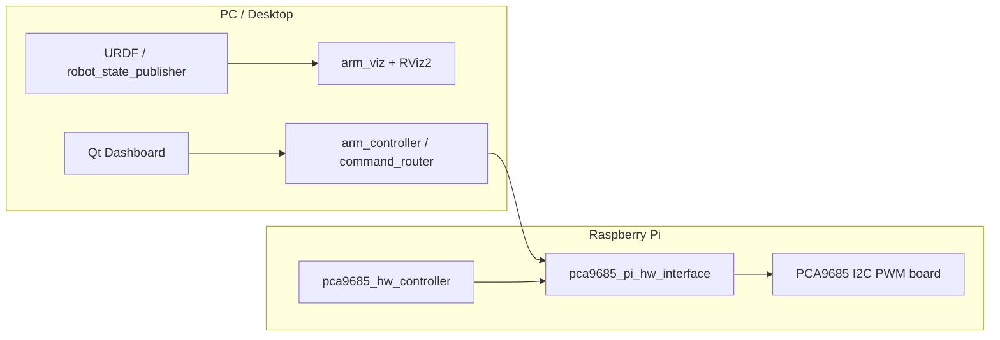

# Robotic Arm ROS 2 Workspace

This repository contains a ROS 2 Jazzy workspace for a Raspberry Pi driven robotic arm, plus a separate Qt dashboard application.

The project is split between two machines:

- Raspberry Pi: runs the hardware-facing ROS 2 stack for the PCA9685 servo driver.
- PC: runs the URDF-based visualization and the Qt dashboard.

I did not use the URDF on the Raspberry Pi because it runs Ubuntu 24 in headless mode, so there is no GUI there. The URDF, RViz, and the Qt dashboard are used on the PC only.

## Architecture



### Main pieces

- `src/pca9685_pi_hw_interface`: ros2_control hardware interface for the Raspberry Pi and the PCA9685 driver.
- `src/demos_pca9685_hw_controller`: demo controller launch that brings up `ros2_control_node` and the controllers.
- `src/arm_controller`: command routing node used to forward user commands to the rest of the system.
- `src/arm_viz`: digital twin side with URDF, `robot_state_publisher`, and RViz2.
- `dashboard/`: standalone Qt dashboard application, built and run on the PC only.
- `deploy.sh`: syncs the ROS 2 `src/` folder to the Raspberry Pi and builds the remote workspace there.

## Dependencies

### Common tools

- Ubuntu 24.04
- ROS 2 Jazzy
- `git`
- `cmake`
- `build-essential`
- `python3-colcon-common-extensions`

### Raspberry Pi dependencies

Install the ROS packages needed by the hardware side:

- `ros-jazzy-hardware-interface`
- `ros-jazzy-ros2-control`
- `ros-jazzy-controller-manager`

You also need I2C enabled on the Pi and access to the PCA9685 board, typically on `/dev/i2c-1`.

### PC dependencies

Install the visualization and desktop packages:

- `ros-jazzy-rviz2`
- `ros-jazzy-robot-state-publisher`
- `ros-jazzy-xacro`
- `ros-jazzy-ros2-control`
- `ros-jazzy-controller-manager`
- Qt development packages, such as `qt6-base-dev` or `qtbase5-dev` depending on your Qt version

## Build The ROS 2 Workspace

From the repository root:

```bash
source /opt/ros/jazzy/setup.bash
colcon build --symlink-install
source install/setup.bash
```

If you want to clean the workspace, remove `build/`, `install/`, and `log/`.

## Run On The Raspberry Pi

This side is headless and should only run the hardware/control stack.

1. Copy the ROS 2 packages to the Pi:

```bash
./deploy.sh
```

2. On the Pi, build the workspace and source it:

```bash
source /opt/ros/jazzy/setup.bash
cd ~/ros2_ws
colcon build --symlink-install
source install/setup.bash
```

3. Launch the hardware/controller demo:

```bash
ros2 launch demos_pca9685_hw_controller robot_3servo.launch.py
```

## Run On The PC

The PC is where the URDF, RViz, and Qt dashboard run.

1. Build and source the ROS 2 workspace:

```bash
source /opt/ros/jazzy/setup.bash
colcon build --symlink-install
source install/setup.bash
```

2. Start the visualization stack:

```bash
ros2 launch arm_controller controller.launch.py
```

This launch starts the command router and includes the `arm_viz` digital twin launch.

3. Build the Qt dashboard from the separate top-level `dashboard/dashboard` project:

```bash
cmake -S dashboard/dashboard -B dashboard/build
cmake --build dashboard/build -j
./dashboard/build/dashboard
```

## Notes

- The Qt dashboard is intentionally kept on the PC only.
- The URDF and RViz-based digital twin are also PC only.
- The Pi side is used for hardware access and control, without GUI components.
- If your Qt installation uses a different major version, keep the matching Qt dev package installed and let CMake detect it automatically.
